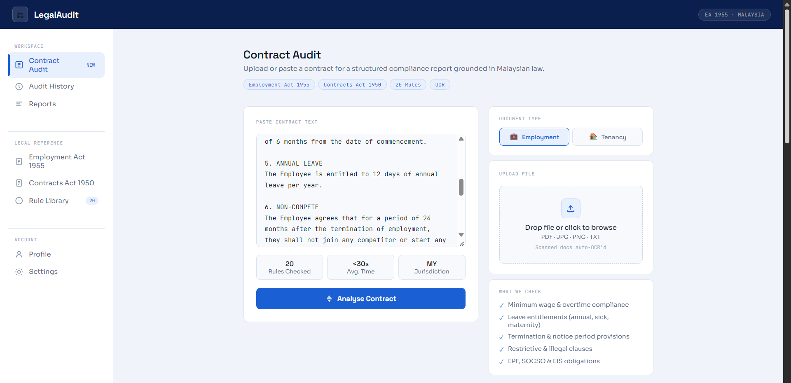
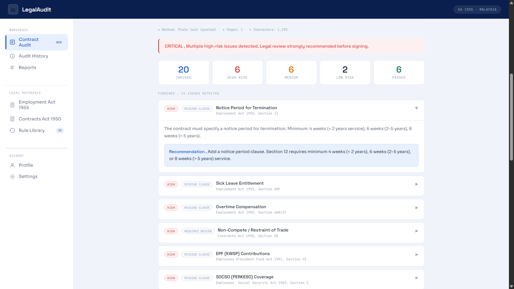

  


A rule-based expert system that checks Malaysian employment contracts and residential tenancy agreements against the law, then explains every finding.





Upload a contract (PDF, scan, image or plain text), pick the document type, and get back a risk-rated report that cites the exact statute behind each issue. The report can be exported as a PDF.

> Built as a university project for AIT103 Introduction to Intelligence Application. It is a learning project, not legal advice.

**[Watch the demo video](https://drive.google.com/file/d/1h3_VtHazYTa1bpvD-sJTFTKNZE1_sLwz/view)**

## What it does

- **38 legal rules** (20 employment, 18 tenancy) mapped to real Malaysian statutes
- **Multi-layer text extraction**: PyMuPDF, then pdfplumber, then Tesseract OCR for scanned files and images
- **Document relevance check** that rejects the wrong type of document before analysis
- **Clause validation** beyond keyword matching, such as pulling out the salary figure and checking notice period length
- **Explanation facility** that shows why each rule fired, with the matched text, the statute and a recommended fix
- **Conflict resolution** so overlapping rules don't produce duplicate or contradictory findings
- **PDF compliance report** export

## How it works

```
Upload / paste text
        |
   OCR processor ---- PyMuPDF -> pdfplumber -> Tesseract
        |
 Relevance check ---- is this really an employment / tenancy contract?
        |
 Inference engine ---- evaluates rules from the knowledge base
        |
 Conflict resolution -> Explanation facility
        |
  JSON report -> Web UI -> PDF export
```

Each rule in `knowledge_base.py` has an ID, statute reference, keywords, a check type, a risk level, a priority and a recommendation. A rule either flags a clause that is missing (`presence`) or a risky clause that is there (`risk_keyword`). Because the rules are data and not code, adding a new one doesn't require touching the engine.

## Acts covered

**Employment:** Employment Act 1955, Contracts Act 1950, EPF Act 1991, Employees' Social Security Act 1969, Minimum Wages Order 2022, Human Resources Development Act 2001

**Tenancy:** Contracts Act 1950, Stamp Act 1949, National Land Code 1965

## Tech stack

Python, Flask, PyMuPDF, pdfplumber, Tesseract (pytesseract), ReportLab, vanilla HTML/CSS/JS

## Getting started

**1. Install Tesseract** (only needed for scanned documents and images)

- Windows: https://github.com/UB-Mannheim/tesseract/wiki (add it to PATH)
- macOS: `brew install tesseract`
- Linux: `sudo apt install tesseract-ocr`

**2. Set up the project**

```bash
git clone https://github.com/mohammedadalachi/legalaudit.git
cd legalaudit
python -m venv venv
source venv/bin/activate      # Windows: venv\Scripts\activate
pip install -r requirements.txt
```

**3. Run it**

```bash
python app.py
```

Open http://localhost:5000

## Try it

Paste the contents of `samples/sample_employment.txt` and select *Employment Contract*, or paste `samples/sample_tenancy.txt` and select *Residential Tenancy Agreement*. Both samples contain deliberate violations so you can see the findings and explanations.

## API

| Endpoint | Method | Description |
|---|---|---|
| `/` | GET | Web interface |
| `/analyse` | POST | Analyse a file upload (`multipart/form-data`) or pasted text (`{"text": "...", "doc_type": "employment"}`) |
| `/download-report` | POST | Generate a PDF from an analysis result |
| `/health` | GET | Liveness check |

## Project structure

```
legalaudit/
├── app.py                 Flask server and routes
├── knowledge_base.py      The 38 legal rules
├── inference_engine.py    Rule evaluation, conflict resolution, explanations
├── ocr_processor.py       Multi-layer text extraction
├── pdf_report.py          PDF report generator
├── templates/index.html   Web interface
├── samples/               Test contracts
├── research/              Keyword vs learned classifier study
└── requirements.txt
```

## Limitations

- Matching is keyword-based, so unusual wording can be missed
- Rules reflect the law as written in the covered Acts and may not track later amendments
- OCR quality depends on scan quality
- Output is informational only and is not a substitute for a lawyer

## Research: keywords vs learned classifiers

The `research/` folder measures how the keyword engine compares with TF-IDF classifiers on 266 clauses labelled for the 38 rule topics. Five-fold cross-validation, same folds for every method.

| method | micro F1 (95% CI) | recall: standard wording | recall: paraphrase | false alarms on non-rule clauses |
|---|---|---|---|---|
| keywords (as shipped) | 0.59 (0.54-0.64) | 0.97 | 0.03 | 3% |
| keywords, whole-word match | 0.59 (0.54-0.65) | 0.94 | 0.01 | 3% |
| TF-IDF + logistic regression | 0.52 (0.46-0.59) | 0.58 | 0.47 | 58% |

- Matching keywords as substrings caused false findings (`nda` inside "calendar", `cat` inside "vacates"). This branch matches whole words instead. Precision rose from 0.72 to 0.79 and recall fell from 0.50 to 0.47. Output on both sample contracts is unchanged.
- Keywords find almost every standard clause and almost no paraphrase. TF-IDF finds more paraphrases but invents a rule on most clauses that match none.
- Overall F1 does not separate the methods at this sample size.

Limits: the clauses were written for this study with AI assistance, so the paraphrase results are a stress test and not an estimate for real contracts. The author has reviewed every label. Embedding, fine-tuned and LLM methods have not been run. Details are in [research/README.md](research/README.md).
## Author

Dalachi Mohammed Abderrahmane ([@mohammedadalachi](https://github.com/mohammedadalachi))

## License

MIT. See [LICENSE](LICENSE).


